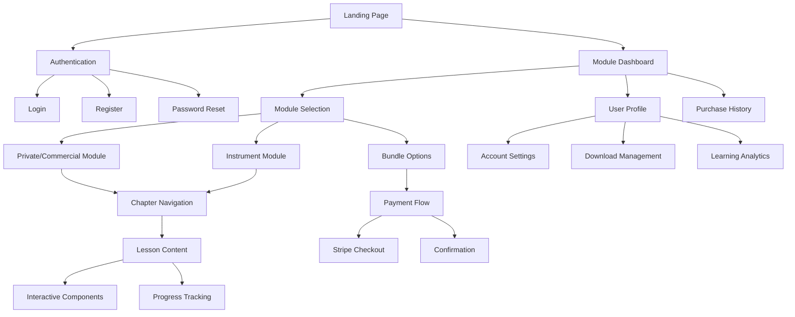
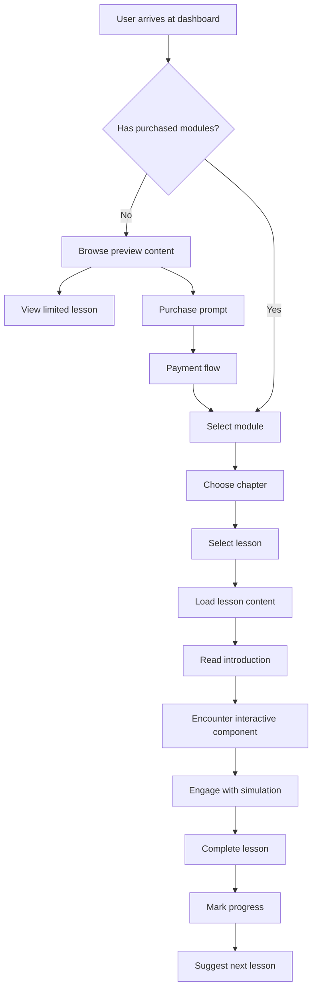
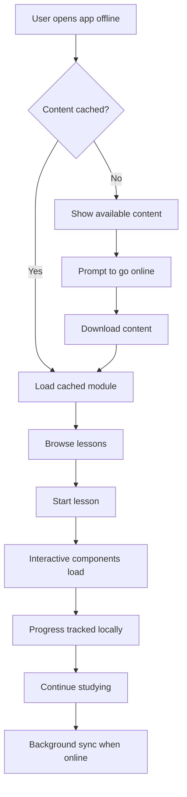
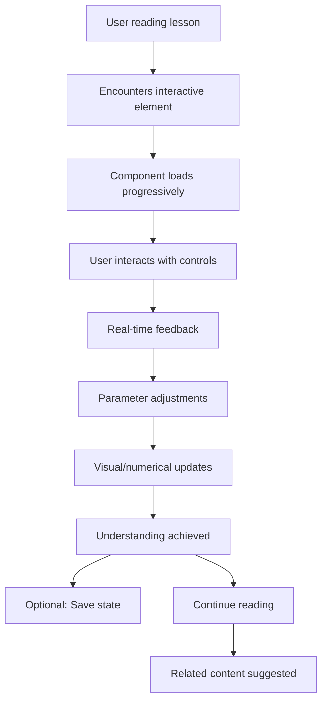

# Interactive Pilot Handbook - Frontend Specification

## Introduction

### UX Goals & Principles

**Primary UX Goal**: Create an engaging, accessible, and efficient learning platform that transforms complex aviation concepts into understandable, interactive experiences for pilot certification students.

**Core UX Principles**:
1. **Learning-First Design** - Every interface decision supports effective knowledge acquisition
2. **Accessibility Without Compromise** - WCAG 2.1 AA compliance while maintaining visual appeal
3. **Performance as UX** - 60fps interactions and <3s load times are non-negotiable
4. **Offline-First Mindset** - Seamless experience regardless of connectivity
5. **Progressive Complexity** - Interface adapts to user expertise and progress
6. **Trust Through Transparency** - Clear progress indicators, pricing, and system status

### Target User Personas

**Primary Persona - Student Pilot Sarah**
- Age: 25-35, pursuing Private Pilot certification
- Tech comfort: High, expects modern app experiences
- Learning style: Visual learner, prefers interactive content
- Context: Studies during commute, at home, often offline
- Pain points: Expensive traditional materials, static content, poor mobile experience
- Goals: Pass FAA knowledge test, understand concepts deeply, study efficiently

**Secondary Persona - Instrument Student Mike**
- Age: 30-45, experienced private pilot seeking Instrument rating
- Tech comfort: Moderate, values functionality over aesthetics
- Learning style: Hands-on, needs practice with procedures
- Context: Limited study time, professional obligations
- Pain points: Complex regulations, abstract concepts, time constraints
- Goals: Master IFR procedures, maintain proficiency, quick reference access

**Tertiary Persona - CFI Instructor Lisa**
- Age: 28-50, Certified Flight Instructor
- Tech comfort: Variable, focused on teaching effectiveness
- Learning style: Comprehensive, needs to explain concepts clearly
- Context: Teaching environment, student progress tracking
- Pain points: Outdated teaching materials, student engagement challenges
- Goals: Effective instruction, student success tracking, modern teaching tools

### Usability Goals

**Quantitative Usability Targets**:
- **Task Completion Rate**: >95% for core learning tasks
- **Time to First Interactive**: <5 seconds from lesson entry
- **Navigation Success**: >90% users find content without help
- **Error Recovery**: <10 seconds to recover from user errors
- **Mobile Usability**: 100% feature parity across devices

**Qualitative Usability Goals**:
- **Intuitive Navigation**: Users understand interface immediately
- **Learning Flow**: Minimal cognitive load for interface operations
- **Confidence Building**: Clear progress feedback and achievement recognition
- **Engagement**: Interface encourages continued learning
- **Professional Feel**: Builds trust in educational content quality

### Design Principles

**1. Clarity Over Cleverness**
- Information hierarchy supports learning objectives
- Interactive elements have obvious affordances
- Technical aviation content presented clearly

**2. Consistency Builds Competence**
- Predictable interaction patterns across all components
- Consistent visual language for similar functions
- Standardized terminology and iconography

**3. Progressive Disclosure**
- Complex concepts introduced gradually
- Optional advanced information available on demand
- Adaptive interface based on user progress

**4. Immediate Feedback**
- Real-time response to user interactions
- Clear system status for all operations
- Progress indicators for long-running processes

**5. Respectful Interruption**
- Non-intrusive notifications and updates
- User control over information density
- Graceful handling of connectivity changes

### Change Log

| Change | Date | Version | Description | Author |
|--------|------|---------|-------------|---------|
| Initial Spec | 2025-06-24 | 1.0.0 | Complete frontend specification for Interactive Pilot Handbook | Sally (UX Expert) |

## Information Architecture (IA)

### Site Map/Screen Inventory



**Screen Inventory**:
- **Public Screens** (8): Landing, About, Pricing, Login, Register, Password Reset, Terms, Privacy
- **Authenticated Screens** (12): Dashboard, Profile, Settings, Purchase History, Module Selection, Chapter Navigation, Lesson Content, Interactive Components, Progress, Downloads, Payment, Confirmation
- **Administrative Screens** (6): User Management, Content Management, Analytics, Payment Management, System Health, Configuration

### Navigation Structure

**Primary Navigation**:
- **Dashboard** - Module overview and progress
- **Learn** - Active learning session
- **Progress** - Achievement and analytics
- **Profile** - Account and preferences
- **Help** - Support and documentation

**Secondary Navigation (Context-Dependent)**:
- **Module Level**: Chapter selection, search, bookmarks
- **Chapter Level**: Lesson navigation, table of contents
- **Lesson Level**: Previous/next, related content, notes

**Breadcrumb Navigation**:
- Format: Module > Chapter > Lesson > Section
- Always-visible for wayfinding
- Clickable for quick navigation

## User Flows

### Critical User Flow 1: First-Time Learning Session



**Entry Points**: Dashboard, direct lesson links, search results
**Success Criteria**: User completes first interactive lesson
**Edge Cases**: Payment failures, connectivity issues, browser compatibility

### Critical User Flow 2: Offline Study Session



**Entry Points**: PWA launch, bookmark access
**Success Criteria**: Full functionality maintained offline
**Edge Cases**: Storage limits, sync conflicts, partial downloads

### Critical User Flow 3: Interactive Component Engagement



**Entry Points**: Lesson content, search results, bookmarks
**Success Criteria**: User demonstrates understanding through interaction
**Edge Cases**: Performance issues, input validation, accessibility needs

## Wireframes & Mockups

### Key Screen Layouts

**Dashboard Layout (Desktop)**:
```
+----------------------------------------------------------+
| Header: Logo | Navigation | User Menu | Offline Status  |
+----------------------------------------------------------+
| Welcome Message & Progress Overview                      |
+----------------------------------------------------------+
| Purchased Modules Grid                  | Recent Activity|
| +----------------+ +----------------+   | +------------+ |
| | Private/Comm   | | Instrument     |   | - Lesson 1  | |
| | Progress: 65%  | | Progress: 23%  |   | - Lesson 3  | |
| | [Continue]     | | [Continue]     |   | - Chapter 2 | |
| +----------------+ +----------------+   | +------------+ |
+------------------------------------------+---------------+
| Available Modules | Quick Actions        | Study Stats   |
+----------------------------------------------------------+
```

**Lesson Content Layout (Desktop)**:
```
+----------------------------------------------------------+
| Header with Progress Bar                                 |
+----------------------------------------------------------+
| Sidebar TOC  | Main Content Area      | Interactive     |
| +----------+ | +--------------------+ | Component       |
| | Chapters | | # Lesson Title     | | +-------------+ |
| | - Ch 1   | | Lesson content...  | | | [Component] | |
| | - Ch 2   | | More content...    | | | Interactive | |
| | - Ch 3   | | ## Section Header  | | | Controls... | |
| +----------+ | Content continues... | | +-------------+ |
|              | [Previous] [Next]    |                   |
+----------------------------------------------------------+
```

**Mobile Layout Adaptations**:
- Collapsible sidebar navigation
- Stacked component layout
- Touch-optimized interactive controls
- Bottom navigation for primary actions

### Design File References

**Figma Design System**: [Link to be provided]
- Component library with all variants
- Color palette and typography scales
- Icon library and illustration style
- Responsive breakpoint demonstrations

**Prototype Links**: [Links to be provided]
- Interactive flow demonstrations
- Animation and transition examples
- Accessibility testing scenarios

### Interaction Notes

**Hover States**: Subtle elevation and color changes
**Focus States**: Clear outline with 2px contrast border
**Loading States**: Progressive disclosure with skeleton screens
**Error States**: Inline validation with recovery suggestions
**Success States**: Subtle confirmation with progress feedback

## Component Library/Design System

### Core Components

**Button Component**:
- **Variants**: Primary, Secondary, Tertiary, Danger
- **Sizes**: Small (32px), Medium (40px), Large (48px)
- **States**: Default, Hover, Focus, Active, Disabled, Loading
- **Usage**: Primary for main actions, Secondary for alternatives

**Interactive Component Container**:
- **Base**: Canvas element with controls overlay
- **Loading**: Skeleton with progress indicator
- **Error**: Fallback with retry option
- **Responsive**: Adapts complexity to screen size

**Navigation Components**:
- **Primary Nav**: Always visible, collapsible on mobile
- **Breadcrumbs**: Hierarchical navigation with overflow handling
- **Progress Indicator**: Visual completion status
- **Table of Contents**: Collapsible chapter/lesson structure

**Content Components**:
- **Lesson Card**: Title, progress, duration, difficulty
- **Chapter Overview**: Learning objectives, estimated time
- **Definition Tooltip**: Hover/tap aviation term explanations
- **Callout Boxes**: Important information, safety warnings

**Form Components**:
- **Input Fields**: Text, email, password with validation
- **Payment Forms**: Stripe-integrated with security indicators
- **Search**: Global content search with filters
- **Preferences**: Settings with immediate preview

### Usage Guidelines

**Component Selection Criteria**:
- **Learning Context**: Choose components that support educational goals
- **Accessibility**: Ensure all interactions work with keyboard and screen readers
- **Performance**: Prioritize components that maintain 60fps performance
- **Consistency**: Use established patterns before creating new ones

**Composition Rules**:
- Maximum 3 interactive elements per viewport
- Consistent spacing using 8px grid system
- Maintain 4.5:1 color contrast ratio minimum
- Touch targets minimum 44x44px on mobile

## Branding & Style Guide

### Visual Identity

**Brand Personality**: Professional, Modern, Trustworthy, Innovative, Approachable

**Design Language**: Clean minimalism inspired by Cartesian.app with aviation-specific visual metaphors including sectional chart aesthetics, instrument panel influences, and clean geometric patterns.

### Color Palette

**Primary Colors**:
- **Aviation Blue**: #1E40AF (Primary actions, links, focus states)
- **Sky Blue**: #3B82F6 (Secondary actions, progress indicators)
- **Horizon Blue**: #93C5FD (Backgrounds, subtle elements)

**Semantic Colors**:
- **Success**: #059669 (Completed lessons, positive feedback)
- **Warning**: #D97706 (Attention items, important callouts)
- **Error**: #DC2626 (Validation errors, system issues)
- **Info**: #0284C7 (Informational messages, tips)

**Neutral Palette**:
- **Text Primary**: #111827 (Main content, headings)
- **Text Secondary**: #6B7280 (Supporting text, captions)
- **Text Tertiary**: #9CA3AF (Placeholder text, disabled states)
- **Background**: #FFFFFF (Main background)
- **Surface**: #F9FAFB (Card backgrounds, panels)
- **Border**: #E5E7EB (Dividers, input borders)

**Dark Mode Adaptations**:
- Automatic system preference detection
- High contrast maintained across all colors
- Blue accent colors remain consistent for brand recognition

### Typography

**Primary Font**: Inter (Google Fonts)
- **Rationale**: Excellent readability, comprehensive character set, optimized for screens
- **Fallback**: system-ui, -apple-system, sans-serif

**Font Scale** (1.25 ratio):
- **H1**: 3rem (48px) - Page titles, major headings
- **H2**: 2.25rem (36px) - Section headings, chapter titles
- **H3**: 1.875rem (30px) - Subsection headings, lesson titles
- **H4**: 1.5rem (24px) - Component headings, card titles
- **H5**: 1.25rem (20px) - Small headings, labels
- **Body Large**: 1.125rem (18px) - Main content, lesson text
- **Body**: 1rem (16px) - Default text, UI elements
- **Body Small**: 0.875rem (14px) - Captions, meta information
- **Caption**: 0.75rem (12px) - Fine print, timestamps

**Font Weights**:
- **Regular (400)**: Body text, default content
- **Medium (500)**: Emphasis, button text
- **Semibold (600)**: Headings, important labels
- **Bold (700)**: Strong emphasis, warnings

### Iconography

**Icon System**: Heroicons (MIT licensed)
- **Sizes**: 16px, 20px, 24px, 32px
- **Styles**: Outline (primary), Solid (emphasis)
- **Custom Icons**: Aviation-specific symbols (VOR, runway, aircraft)

**Aviation Icon Set** (Custom SVG):
- Aircraft symbols, navigation aids, weather symbols
- Consistent with sectional chart symbology
- Scalable vector format for all device densities

### Spacing & Layout

**Grid System**: 8px base unit
- **Micro spacing**: 4px, 8px (tight elements)
- **Component spacing**: 16px, 24px (standard gaps)
- **Section spacing**: 32px, 48px (major divisions)
- **Layout spacing**: 64px, 96px (page sections)

**Layout Containers**:
- **Full width**: Interactive components, hero sections
- **Content width**: 1024px max (reading comfort)
- **Narrow width**: 768px max (forms, focused content)

**Responsive Breakpoints**:
- **Mobile**: 320px - 767px
- **Tablet**: 768px - 1023px
- **Desktop**: 1024px - 1439px
- **Large Desktop**: 1440px+

## Accessibility Requirements

### WCAG 2.1 AA Compliance

**Visual Requirements**:
- **Color Contrast**: 4.5:1 minimum for normal text, 3:1 for large text
- **Color Independence**: Information conveyed through multiple visual means
- **Focus Indicators**: 2px minimum, high contrast
- **Zoom Support**: 200% zoom without horizontal scrolling

**Interaction Requirements**:
- **Keyboard Navigation**: Full functionality without mouse
- **Focus Management**: Logical tab order, focus trapping in modals
- **Touch Targets**: Minimum 44x44px, adequate spacing
- **Time Limits**: User control over timeouts, no auto-refresh

**Content Requirements**:
- **Alt Text**: Descriptive text for all images and diagrams
- **Headings**: Proper hierarchy (H1-H6) for screen readers
- **Labels**: Associated labels for all form controls
- **Language**: Declared page language, technical term definitions

### Aviation-Specific Accessibility

**Technical Content**:
- **Acronym Expansion**: First use of aviation acronyms spelled out
- **Complex Diagrams**: Alternative text descriptions for charts and diagrams
- **Interactive Simulations**: Keyboard alternatives for all mouse interactions
- **Audio Descriptions**: For video content and visual-only information

**Learning Adaptations**:
- **Reading Level**: Clear language with technical terms defined
- **Cognitive Load**: Chunked information, clear progress indicators
- **Attention Support**: Minimal distractions, focus on learning content
- **Memory Aids**: Consistent navigation, clear wayfinding

### Testing Strategy

**Automated Testing**:
- **axe-core**: Integrated into CI/CD pipeline
- **Lighthouse**: Regular accessibility scoring
- **ESLint**: jsx-a11y rules enforcement

**Manual Testing**:
- **Screen Reader**: NVDA, JAWS, VoiceOver testing
- **Keyboard Only**: Complete task completion without mouse
- **Mobile Accessibility**: TalkBack and VoiceOver on mobile devices
- **Color Blindness**: Color vision deficiency simulation

## Responsiveness Strategy

### Breakpoint Strategy

**Mobile First Approach**:
- Base styles optimized for 320px minimum width
- Progressive enhancement for larger screens
- Touch-first interaction design

**Breakpoint Definitions**:
```css
/* Mobile: 320px - 767px */
@media (max-width: 767px) {
  /* Stack layouts, collapse navigation, simplify interactions */
}

/* Tablet: 768px - 1023px */
@media (min-width: 768px) and (max-width: 1023px) {
  /* Two-column layouts, expanded navigation, full interactions */
}

/* Desktop: 1024px+ */
@media (min-width: 1024px) {
  /* Three-column layouts, hover states, keyboard shortcuts */
}
```

### Component Adaptation Patterns

**Navigation Adaptation**:
- **Mobile**: Bottom tab bar, hamburger menu
- **Tablet**: Collapsible sidebar, top navigation
- **Desktop**: Persistent sidebar, full navigation hierarchy

**Interactive Component Adaptation**:
- **Mobile**: Simplified controls, essential parameters only
- **Tablet**: Full controls with touch optimization
- **Desktop**: Complete feature set with keyboard shortcuts

**Content Layout Adaptation**:
- **Mobile**: Single column, stacked components
- **Tablet**: Two-column with flexible sidebar
- **Desktop**: Three-column with persistent navigation

**Performance Adaptations**:
- **Mobile**: Reduced animation complexity, lazy loading priority
- **Tablet**: Standard animations, balanced loading
- **Desktop**: Full animations, preemptive loading

## Animation & Micro-interactions

### Motion Principles

**Purposeful Motion**:
- Animations support user understanding
- Transitions maintain spatial relationships
- Motion indicates system response and progress

**Performance-First Approach**:
- 60fps target for all animations
- GPU-accelerated properties preferred
- Reduced motion support (prefers-reduced-motion)

**Timing & Easing**:
- **Fast**: 150ms (micro-interactions, hover states)
- **Medium**: 300ms (page transitions, modal open/close)
- **Slow**: 500ms (complex state changes, data loading)
- **Easing**: ease-out for entrances, ease-in for exits

### Key Animations

**Interactive Component Animations**:
- **Parameter Changes**: Smooth value transitions (300ms ease-out)
- **Data Visualization**: Progressive chart building (500ms ease-out)
- **3D Rotations**: Smooth camera movements (400ms ease-in-out)
- **Simulation Playback**: Real-time with pause/resume capability

**Interface Animations**:
- **Page Transitions**: Slide transitions maintaining context (300ms)
- **Modal Dialogs**: Scale and fade entrance (200ms ease-out)
- **Loading States**: Progressive disclosure with skeleton screens
- **Success Feedback**: Subtle scale and color change (150ms)

**Accessibility Considerations**:
- **Reduced Motion**: All animations respect system preference
- **Focus Indicators**: Immediate appearance, no animation delay
- **Error States**: Immediate visibility, no motion required for comprehension

### Micro-interaction Details

**Button Interactions**:
- **Hover**: 2px elevation, 150ms ease-out
- **Active**: 1px elevation, 100ms ease-in
- **Success**: Checkmark animation, 300ms

**Form Interactions**:
- **Focus**: Border color change, 150ms ease-out
- **Validation**: Inline error appearance, 200ms ease-out
- **Success**: Subtle green highlight, 300ms fade

**Navigation Interactions**:
- **Active State**: Underline animation, 200ms ease-out
- **Page Load**: Progress bar animation, duration varies
- **Search**: Expanding search box, 300ms ease-out

## Performance Considerations

### Performance Goals

**Core Web Vitals Targets**:
- **Largest Contentful Paint (LCP)**: <2.5s
- **First Input Delay (FID)**: <100ms
- **Cumulative Layout Shift (CLS)**: <0.1

**Application-Specific Targets**:
- **Interactive Component Load**: <5s initial load
- **60fps Animations**: Maintained during all interactions
- **Offline Transition**: <1s to offline mode indication
- **Search Response**: <200ms for query results

### Design Strategies for Performance

**Asset Optimization**:
- **Images**: WebP format with AVIF fallback, responsive sizing
- **Icons**: SVG sprites, minimal vector complexity
- **Fonts**: Variable fonts where possible, subset for used characters
- **Animations**: CSS transforms over layout properties

**Component Design**:
- **Lazy Loading**: Interactive components load on intersection
- **Code Splitting**: Route-based and component-based splitting
- **Memoization**: Expensive calculations cached appropriately
- **Virtual Scrolling**: For long content lists

**User Experience Optimizations**:
- **Skeleton Screens**: Immediate layout feedback
- **Progressive Enhancement**: Core functionality loads first
- **Intelligent Prefetching**: Predict likely user actions
- **Optimistic Updates**: UI responds before server confirmation

**Bundle Optimization**:
- **Critical CSS**: Above-the-fold styles inlined
- **JavaScript Chunking**: Vendor, app, and route-specific bundles
- **Tree Shaking**: Remove unused code automatically
- **Compression**: Gzip/Brotli for all text assets

## Next Steps

### Immediate Actions Required

**Design System Development**:
1. **Create Figma Component Library** - Build complete design system with all variants
2. **Interactive Component Mockups** - Design detailed specifications for HypoxiaSimulator, VORTrainer, WeatherBuilder
3. **Responsive Prototypes** - Test layouts across all breakpoints
4. **Accessibility Review** - Complete WCAG 2.1 AA compliance audit

**User Research Validation**:
1. **Concept Testing** - Validate key interactive component designs with pilot students
2. **Information Architecture Testing** - Test navigation and content organization
3. **Usability Testing** - Test core user flows with target personas
4. **Performance Perception** - Test loading states and perceived performance

### Design Handoff Checklist

**Design Assets**:
- [ ] Complete Figma design system with developer access
- [ ] Exported assets (icons, images, graphics) in multiple formats
- [ ] Interactive prototypes demonstrating key user flows
- [ ] Animation specifications with timing and easing details

**Technical Specifications**:
- [ ] Component specifications with props and states documented
- [ ] Responsive behavior documented for each component
- [ ] Accessibility requirements for each interaction pattern
- [ ] Performance requirements for each animated element

**Documentation**:
- [ ] Style guide with code examples for developers
- [ ] Interaction patterns guide with implementation notes
- [ ] Accessibility implementation guide
- [ ] Performance optimization recommendations

**Validation**:
- [ ] User testing results with design recommendations
- [ ] Stakeholder approval on design direction
- [ ] Technical feasibility confirmation from development team
- [ ] Performance benchmark validation

### Development Collaboration

**Regular Check-ins**:
- **Weekly Design Reviews** - Validate implementation against specifications
- **Interactive Component Testing** - Verify 60fps performance and user experience
- **Accessibility Testing** - Ongoing compliance verification
- **User Feedback Integration** - Continuous improvement based on user data

**Quality Assurance**:
- **Design QA Process** - Pixel-perfect implementation verification
- **Cross-browser Testing** - Visual consistency across all supported browsers
- **Device Testing** - Real device testing for touch interactions
- **Performance Monitoring** - Ongoing performance impact assessment

---

*Frontend Specification completed by Sally (UX Expert)*
*Date: 2025-06-24*
*Next: Architect Agent for Technical Architecture Document*
