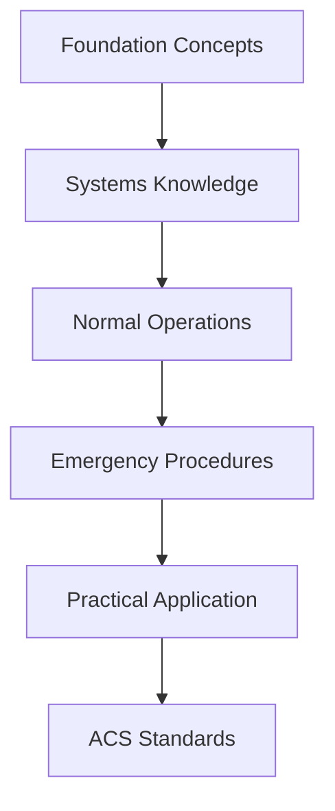

# {frontmatter.title}

## Section Overview

This section covers the essential knowledge areas for **{frontmatter.title.toLowerCase()}** in private pilot training. These topics form the foundation for safe and proficient flight operations.

## What You'll Learn

{frontmatter.objectives.map((objective, index) => (
  
✈️ {objective}

))}

## Section Structure

This section contains **{frontmatter.total_lessons} lessons** with an estimated study time of **{frontmatter.estimated_hours}**.

### Lesson Progression

1. **Foundation Concepts** - Basic principles and terminology
2. **Systems Knowledge** - Detailed component understanding  
3. **Operational Applications** - Real-world usage and procedures
4. **Emergency Procedures** - Abnormal and emergency situations
5. **Integration** - How concepts work together in flight operations

## Learning Path

## Prerequisites

Before starting this section, ensure you have completed:
- Basic aeronautical knowledge
- Aircraft familiarization
- Previous prerequisite sections

## Study Strategy

### Recommended Approach
1. **Read through overview** to understand big picture
2. **Complete lessons sequentially** - they build on each other
3. **Practice with scenarios** after each major concept
4. **Review regularly** to maintain knowledge retention

### Time Management
- **Daily Study**: 30-45 minutes per lesson
- **Weekly Review**: 1 hour consolidation 
- **Practical Application**: Regular flight training correlation

## Assessment & Standards

### Knowledge Requirements
This section prepares you for:
- Written examination questions
- Oral examination topics  
- Practical test scenarios

### ACS Integration
Content aligns with current FAA Airman Certification Standards (ACS) for Private Pilot certification.

## Getting Started

Ready to begin? Start with the first lesson in this section, or use the navigation menu to jump to a specific topic.

**Next**: Begin with [First Lesson Name](./first-lesson-file)

---

**Section Progress**: Track your completion as you work through each lesson  
**Estimated Completion Time**: {frontmatter.estimated_hours}  
**ACS Alignment**: ✅ Current standards