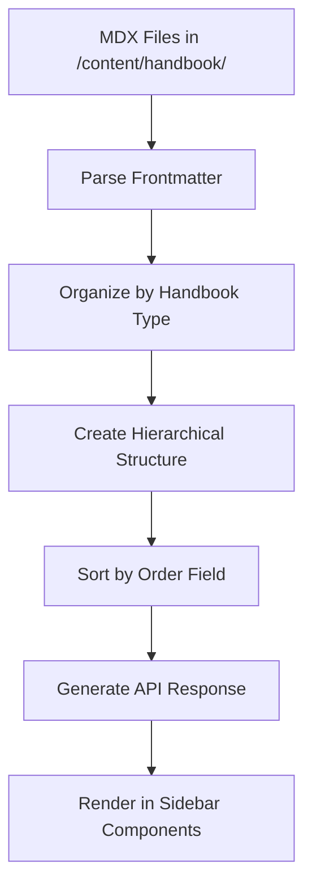

# CFI Handbook Table of Contents Management Guide

## Overview

The CFI Handbook uses a dynamic Table of Contents (TOC) system that automatically generates navigation structures from MDX files stored in the `/content/handbook/` directory. The system creates hierarchical navigation based on file structure and frontmatter metadata, supporting multiple handbook types (private-pilot, instrument, commercial, etc.).

## How the TOC System Works

### System Architecture

1. **Content Scanning**: The system recursively scans `/content/handbook/` for `.mdx` files
2. **Frontmatter Parsing**: Extracts metadata from each file's YAML frontmatter
3. **Hierarchical Organization**: Builds nested structures based on directory structure and metadata
4. **API Generation**: Serves structured TOC data via `/api/handbook/toc` endpoint
5. **Client Rendering**: Components consume the API to render navigation sidebars

### File Processing Flow



## Directory Structure

The content is organized using a three-level hierarchy:

```
content/handbook/
├── handbook-type/          # Level 1: Handbook Type (private-pilot, instrument, etc.)
│   ├── lesson.mdx         # Direct lesson under handbook
│   ├── section/           # Level 2: Section (principles-of-flight, aircraft-systems)
│   │   ├── lesson.mdx     # Lesson within section
│   │   └── subsection/    # Level 3: Subsection (powerplant, navigation)
│   │       └── lesson.mdx # Lesson within subsection
│   └── another-section/
└── another-handbook-type/
```

### Current Structure Examples

```
content/handbook/
├── private-pilot/
│   └── principles-of-flight/
│       ├── four-forces.mdx
│       ├── airfoil-theory.mdx
│       └── angle-of-attack.mdx
├── aircraft-systems/
│   └── engine-systems.mdx
├── procedures/
│   └── preflight-procedures.mdx
├── reference/
│   └── weather-codes.mdx
└── regulations/
    └── far-part-61.mdx
```

## MDX Frontmatter Configuration

### Required Fields

Every MDX file must include these frontmatter fields:

```yaml
---
title: Your Lesson Title # Display name in TOC
---
```

### Optional Fields

```yaml
---
# Basic Metadata
title: Advanced Engine Operations
description: Detailed engine systems and troubleshooting
duration: 45 min

# TOC Organization
category: aircraft-systems # Groups related content
section: powerplant # Section within handbook
subsection: reciprocating # Subsection within section
order: 5 # Sorting order (lower = earlier)

# Publishing Control
status: published # "draft" to hide from TOC
author: CFI Team
created: 2024-01-15
updated: 2024-02-01

# Educational Metadata
tags: [engine, systems, troubleshooting]
related: [electrical-systems, fuel-systems]
priority: high
---
```

### Field Descriptions

| Field | Type | Purpose | Example |
|-------|------|---------|---------|
| `title` | string | **Required**. Display name in TOC | `"The Four Forces of Flight"` |
| `description` | string | Lesson summary for hover/preview | `"Understanding lift, weight, thrust, and drag"` |
| `category` | string | Groups content within sections | `"principles-of-flight"` |
| `section` | string | Primary section classification | `"aircraft-systems"` |
| `subsection` | string | Secondary classification level | `"powerplant"` |
| `order` | number | Sort order (default: 999) | `1`, `2`, `3` |
| `status` | string | Publishing status (`"published"` or `"draft"`) | `"published"` |
| `duration` | string | Estimated study time | `"20 min"`, `"1 hour"` |
| `tags` | array | Topic keywords for search/filtering | `["engine", "systems"]` |
| `related` | array | Links to related lessons | `["fuel-systems", "electrical"]` |
| `priority` | string | Content importance level | `"high"`, `"medium"`, `"low"` |

## Adding New Content

### 1. Create New Lesson

Create a new `.mdx` file in the appropriate directory:

```bash
# For a new principles of flight lesson
content/handbook/private-pilot/principles-of-flight/weight-and-balance.mdx

# For a new aircraft system
content/handbook/aircraft-systems/electrical-systems.mdx

# For a new subsection lesson
content/handbook/aircraft-systems/powerplant/fuel-injection.mdx
```

### 2. Configure Frontmatter

Add proper frontmatter to control TOC placement:

```yaml
---
title: Weight and Balance Fundamentals
description: Understanding aircraft weight and balance calculations
duration: 30 min
category: principles-of-flight
order: 4
status: published
tags: [weight, balance, calculations, safety]
related: [four-forces, performance]
---
```

### 3. TOC Placement Examples

#### Example 1: Lesson in Existing Section

```yaml
# File: content/handbook/private-pilot/principles-of-flight/lift-generation.mdx
---
title: How Wings Generate Lift
category: principles-of-flight
order: 2
---
```

**Result**: Appears in Private Pilot → Principles of Flight → How Wings Generate Lift

#### Example 2: New Section

```yaml
# File: content/handbook/private-pilot/navigation/dead-reckoning.mdx
---
title: Dead Reckoning Navigation
section: navigation
order: 1
---
```

**Result**: Creates new section "Navigation" under Private Pilot

#### Example 3: Subsection Organization

```yaml
# File: content/handbook/aircraft-systems/powerplant/carburetor-systems.mdx
---
title: Carburetor Systems
section: aircraft-systems
subsection: powerplant
order: 2
---
```

**Result**: Aircraft Systems → Powerplant → Carburetor Systems

## Creating New Handbook Sections

### 1. Directory-Based Sections

Create a new directory under the handbook type:

```bash
mkdir content/handbook/private-pilot/weather
```

Add lessons with appropriate frontmatter:

```yaml
# File: content/handbook/private-pilot/weather/weather-theory.mdx
---
title: Weather Theory and Formation
order: 1
---
```

### 2. Metadata-Based Sections

Use the `section` frontmatter field to create logical groupings:

```yaml
# Multiple files can share the same section
---
title: VFR Weather Minimums
section: weather
category: regulations
order: 1
---
```

### 3. Section Naming

The system automatically formats section names:

- Directory name: `weather-theory` → Display: "Weather Theory"
- Metadata section: `aircraft-performance` → Display: "Aircraft Performance"
- Multiple words: `radio-communications` → Display: "Radio Communications"

## Organizing Content Hierarchically

### Hierarchy Levels

1. **Handbook Type** (directory level): `private-pilot`, `instrument`, `commercial`
2. **Section** (directory or metadata): `principles-of-flight`, `aircraft-systems`
3. **Subsection** (directory or metadata): `powerplant`, `avionics`
4. **Individual Lessons** (MDX files)

### Ordering Content

Use the `order` field to control sequence:

```yaml
# Lesson 1
---
title: Introduction to Navigation
order: 1
---

# Lesson 2
---
title: Pilotage and Dead Reckoning
order: 2
---

# Lesson 3
---
title: Radio Navigation
order: 3
---
```

**Note**: Items without `order` default to 999 and appear last.

### Complex Hierarchy Example

```yaml
# File: content/handbook/instrument/navigation/vor/vor-basics.mdx
---
title: VOR Basics and Theory
section: navigation
subsection: vor
category: radio-navigation
order: 1
---

# File: content/handbook/instrument/navigation/vor/vor-procedures.mdx
---
title: VOR Navigation Procedures
section: navigation
subsection: vor
category: radio-navigation
order: 2
---
```

**Result**:

```
Instrument
└── Navigation
    └── VOR
        ├── VOR Basics and Theory
        └── VOR Navigation Procedures
```

## Creating New Handbook Types

### 1. Create Directory Structure

```bash
mkdir content/handbook/commercial
mkdir content/handbook/commercial/advanced-aerodynamics
mkdir content/handbook/commercial/commercial-operations
```

### 2. Add Initial Content

```yaml
# File: content/handbook/commercial/advanced-aerodynamics/high-altitude-flight.mdx
---
title: High Altitude Flight Operations
description: 'Operations above 18,000 feet MSL'
order: 1
status: published
---
```

### 3. Handbook Type Naming

Directory names are automatically formatted:

- `commercial` → "Commercial"
- `flight-instructor` → "Flight Instructor"
- `airline-transport-pilot` → "Airline Transport Pilot"

## Troubleshooting Common Issues

### Issue 1: Content Not Appearing in TOC

**Symptoms**: MDX file exists but doesn't show in sidebar

**Causes & Solutions**:

1. **File has `status: "draft"`**

   ```yaml
   # Change this:
   status: "draft"
   # To this:
   status: "published"
   ```

2. **Missing required frontmatter**

   ```yaml
   # Must have at minimum:
   ---
   title: Your Lesson Title
   ---
   ```

3. **File extension wrong**
   - Ensure file ends with `.mdx`, not `.md`

4. **Malformed YAML frontmatter**

   ```yaml
   # Wrong - missing quotes around title with special characters
   title: Aircraft Systems: Engine Operations

   # Correct
   title: "Aircraft Systems: Engine Operations"
   ```

### Issue 2: Incorrect TOC Ordering

**Symptoms**: Lessons appear in wrong order

**Solutions**:

1. **Add explicit order numbers**

   ```yaml
   ---
   title: Lesson Title
   order: 1 # Add this
   ---
   ```

2. **Check for duplicate order numbers**
   - Each item in same section should have unique order
   - Use increments of 5 or 10 to allow insertions

3. **Order field must be number, not string**

   ```yaml
   # Wrong
   order: "1"

   # Correct
   order: 1
   ```

### Issue 3: Content in Wrong Section

**Symptoms**: Lesson appears under incorrect section in TOC

**Solutions**:

1. **Check directory structure vs. metadata**

   ```yaml
   # File: content/handbook/private-pilot/wrong-section/lesson.mdx
   # Override with metadata:
   ---
   title: Lesson Title
   section: correct-section # This overrides directory
   ---
   ```

2. **Verify section names match exactly**
   - Section names are case-sensitive
   - Use hyphens, not spaces or underscores

### Issue 4: Section Names Display Incorrectly

**Symptoms**: Section shows as "some-section" instead of "Some Section"

**Cause**: The automatic formatting should handle this, but check:

1. **Use hyphens for word separation**

   ```yaml
   section: aircraft-systems # Becomes "Aircraft Systems"
   ```

2. **Avoid underscores or spaces**

   ```yaml
   # Don't use:
   section: "aircraft_systems"
   section: "aircraft systems"

   # Use:
   section: "aircraft-systems"
   ```

### Issue 5: API Errors

**Symptoms**: TOC fails to load, shows error in console

**Debug Steps**:

1. **Check server logs** for MDX parsing errors
2. **Validate all frontmatter** YAML syntax
3. **Ensure no circular references** in related content
4. **Check file permissions** on content directory

### Issue 6: Performance Issues

**Symptoms**: Slow TOC loading with many files

**Solutions**:

1. **Use `status: "draft"`** for work-in-progress content
2. **Optimize frontmatter** - avoid large related arrays
3. **Consider pagination** for very large handbooks

## Best Practices

### Content Organization

1. **Use consistent naming conventions**

   ```
   // Good
   principles-of-flight/
   aircraft-systems/
   flight-procedures/

   // Avoid
   PrinciplesOfFlight/
   aircraft_systems/
   flight procedures/
   ```

2. **Plan hierarchy before creating**
   - Sketch out section structure first
   - Consider logical learning progression
   - Group related topics together

3. **Use meaningful order increments**

   ```yaml
   # Good - allows insertions
   order: 10
   order: 20
   order: 30

   # Avoid - hard to reorder
   order: 1
   order: 2
   order: 3
   ```

### Frontmatter Standards

1. **Always include core metadata**

   ```yaml
   ---
   title: 'Clear, Descriptive Title'
   description: Brief summary of content
   order: 10
   status: published
   ---
   ```

2. **Use consistent categorization**

   ```yaml
   # Establish category standards across team
   category: principles-of-flight # Not "flight-principles"
   section: aircraft-systems # Not "systems"
   ```

3. **Keep related arrays manageable**

   ```yaml
   # Good
   related: ["four-forces", "airfoil-theory"]

   # Avoid large arrays
   related: ["lesson1", "lesson2", "lesson3", "lesson4", "lesson5"]
   ```

### Development Workflow

1. **Create draft first**

   ```yaml
   ---
   title: New Lesson
   status: draft # Hide from TOC while developing
   ---
   ```

2. **Test TOC locally**
   - Start dev server: `npm run dev`
   - Navigate to handbook to see TOC changes
   - Check `/api/handbook/toc` endpoint directly

3. **Use version control effectively**

   ```bash
   # Create feature branch for new content
   git checkout -b feature/weather-lessons

   # Add related content together
   git add content/handbook/private-pilot/weather/
   git commit -m "Add weather theory lessons"
   ```

## API Reference

### TOC Endpoint

**URL**: `/api/handbook/toc`
**Method**: `GET`
**Response**: JSON object with handbook structure

**Response Format**:

```json
{
  "private-pilot": {
    "title": "Private Pilot",
    "items": [
      {
        "title": "Principles Of Flight",
        "href": "/en/handbook/private-pilot/principles-of-flight",
        "items": [
          {
            "title": "The Four Forces of Flight",
            "href": "/en/handbook/private-pilot/principles-of-flight/four-forces",
            "items": [],
            "order": 1,
            "category": "principles-of-flight"
          }
        ],
        "order": 0,
        "category": "principles-of-flight"
      }
    ]
  }
}
```

### Content Analysis Utility

The `generateHandbookToc()` function in `/src/lib/handbook-content.ts` provides:

- **File Discovery**: Recursively finds all `.mdx` files
- **Frontmatter Parsing**: Extracts metadata using `gray-matter`
- **Hierarchy Building**: Creates nested structure from directory + metadata
- **Sorting**: Orders content by `order` field
- **URL Generation**: Creates proper handbook URLs

## Component Integration

### Using TOC Data

```typescript
// In a React component
import { HandbookToc } from '@/types/handbook';

const HandbookSidebar = ({ handbookType }: { handbookType: string }) => {
  const [toc, setToc] = useState<HandbookToc>({});

  useEffect(() => {
    fetch('/api/handbook/toc')
      .then(res => res.json())
      .then(setToc);
  }, []);

  const handbookData = toc[handbookType];

  return (
    <nav>
      {handbookData?.items.map(section => (
        <SectionComponent key={section.title} section={section} />
      ))}
    </nav>
  );
};
```

## Summary

The CFI Handbook TOC system provides flexible, automated navigation generation based on file structure and metadata. Success requires:

1. **Proper directory organization** following the three-level hierarchy
2. **Complete frontmatter** with required title and optional organizational fields
3. **Consistent naming conventions** for sections and categories
4. **Logical content ordering** using the order field
5. **Draft status management** to control content visibility

For complex organizational needs, use the metadata fields (`section`, `subsection`, `category`) to override directory-based structure while maintaining clear content hierarchy.
